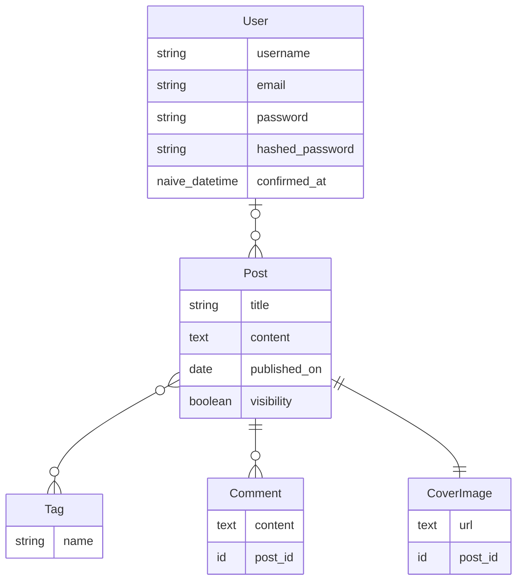

# Phoenix Blog Project

## Summary
Blog project part of Dockyard Curriculum course.

This project is only for studies purpose. All of what is seen here must not be considered for a production application.

## Stack
* [Phoenix 1.7.14](https://www.phoenixframework.org/)
* [Elixir 1.14.4](https://elixir-lang.org/)

## Entity Relationship Diagram
